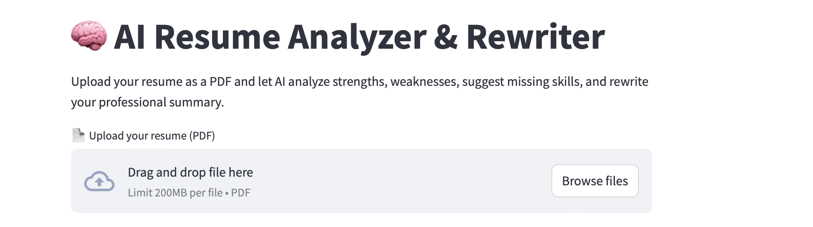

# 🧠 Resume AI Analyzer & Rewriter

An AI-powered tool that:

- Extracts text from any resume (PDF)
- Analyzes strengths & weaknesses
- Suggests ATS-optimized skills to add
- Rewrites your professional summary
- Outputs a structured JSON report

🚀 Built with **Python**, **OpenAI GPT-4.1**, and **Streamlit**.


## 🔧 Features

- PDF parsing with `PyPDF2`
- AI-based resume scoring
- Identification of strengths & weaknesses
- Recommended skills to add
- Rewritten professional summary
- JSON output for further automation
- Web UI using Streamlit
- CLI script for batch / local use


## 🏗 Project Structure

```bash
resume-ai-analyzer/
│── app.py                  # CLI entrypoint
│── streamlit_app.py        # Web UI (Streamlit)
│── parser.py               # PDF text extraction helpers
│── rewrite_engine.py       # OpenAI LLM logic
│── requirements.txt
│── README.md
│── demo/
│   ├── sample_resume.pdf
│   └── output.json         # Example AI output
```


## 🚀 How to Run This Project

Below are **two ways to use this project**:

### OPTION 1: Run the Web UI (Streamlit)

This is the recommended way for normal users.

### **1. Install dependencies**

```bash
pip install -r requirements.txt
```

### **2. Set your OpenAI API keys**

```bash
export OPENAI_API_KEY="your_api_key_here"
```

### **3. Run the Streamlit app**

```bash
streamlit run streamlit_app.py
```
You will see the analyzer running in the browser.




### Option 2: Run the CLI Tool

### 1. Install dependencies**

```bash
pip install -r requirements.txt
```

### 2. Run the CLI script from the project root

```
python app.py
pdf_path = "demo/sample_resume.pdf"
```

To analyze your own resume:

Place your resume in the demo/ folder (for example demo/my_resume.pdf).

Update app.py:
```
pdf_path = "demo/my_resume.pdf"
```

### 3. The output is written to:
```
demo/output.json
```

You can open this file with any text editor or JSON viewer.

